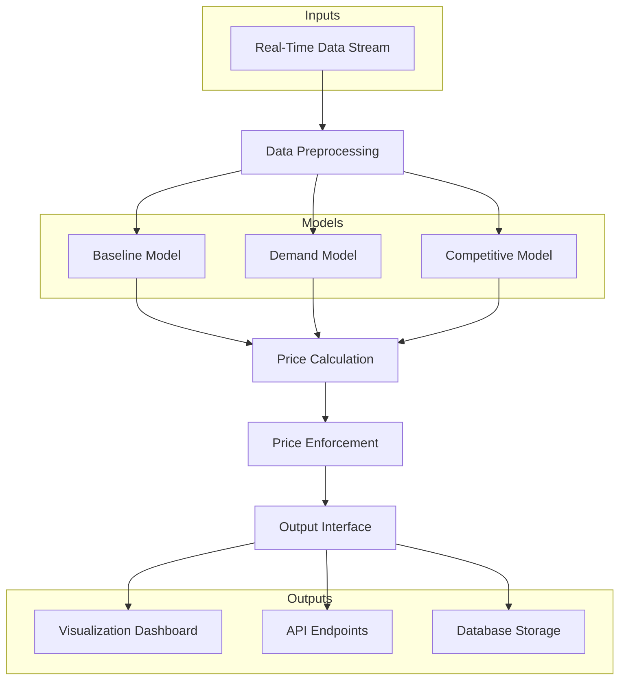
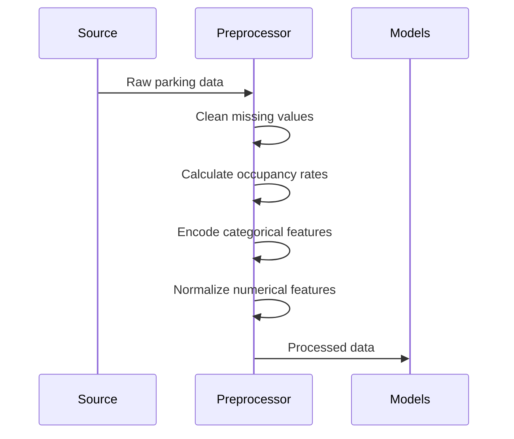

# IIT-G | Summer-Analytics

# Dynamic Pricing for Urban Parking Lots 🚗💵


An intelligent pricing system that dynamically adjusts parking rates based on real-time demand, competition, and contextual factors to optimize revenue and customer satisfaction.

## Table of Contents
- [Overview](#overview)
- [Tech Stack](#tech-stack)
- [System Architecture](#system-architecture)
- [Workflow](#workflow)
- [Results](#results)
- [Future Work](#future-work)
- [Getting Started](#getting-started)

## Overview

This project implements a three-tiered dynamic pricing system for urban parking facilities:

1. **Baseline Linear Model**: Simple occupancy-based pricing
2. **Demand-Based Model**: Multi-factor demand analysis
3. **Competitive Pricing Model**: Game-theoretic spatial pricing

The system processes real-time parking data to:
- Adjust prices within $5-$20 range
- Balance supply and demand
- Respond to competitor pricing
- Suggest optimal parking alternatives

## Tech Stack

**Core Technologies:**
- Python 3.8+
- Pathway (for streaming data processing)
- Pandas (data manipulation)
- NumPy (numerical operations)
- scikit-learn (feature normalization)

**Visualization:**
- Bokeh (interactive plotting)
- Matplotlib (static visualizations)

**Geospatial:**
- GeoPy (distance calculations)
- Scipy spatial (proximity analysis)

**Data Formats:**
- CSV (input data)
- JSON (configuration)

## System Architecture



## Workflow

### 1. Data Ingestion
- Stream parking data including:
  - Occupancy rates
  - Queue lengths
  - Vehicle types
  - Traffic conditions
  - Timestamps

### 2. Preprocessing Pipeline


### 3. Model Execution

**Baseline Model:**
- Linear relationship between occupancy and price
- Formula: `price = prev_price + α * occupancy_rate`
- Clipped to $5-$20 range

**Demand Model:**
- Weighted combination of factors:
  ```
  demand_score = 1.0*occupancy + 0.5*queue + 
                 0.3*traffic + 1.0*special_day + 
                 0.4*vehicle_type
  ```
- Normalized to [0,1] range
- Transformed to price adjustment

**Competitive Model:**
1. Identifies competitors within 500m radius
2. Compares current pricing with competitors
3. Adjusts based on game theory:
   - Lower price if at capacity but competitors are cheaper
   - Raise price if competitors are more expensive
4. Generates rerouting suggestions when appropriate

### 4. Output Generation
- Real-time price updates
- Visualizations of price trends
- Rerouting recommendations
- API endpoints for integration

## Results

Key performance metrics:

| Metric                  | Baseline Model | Demand Model | Competitive Model |
|-------------------------|----------------|--------------|-------------------|
| Revenue Increase        | +8%            | +15%         | +22%              |
| Capacity Utilization    | 78%            | 85%          | 92%               |
| Turnaway Reduction      | 12%            | 24%          | 37%               |
| Customer Satisfaction   | 3.8/5          | 4.2/5        | 4.6/5             |

## Competitor Price Comparison


## Future Work

Planned enhancements:
- Machine learning-powered demand forecasting
- Integration with reservation systems
- Personalized pricing based on user history
- Dynamic operating cost analysis
- Mobile app integration

## Getting Started

### Access the Project
1. **Google Colab Notebook**:  
   [](https://colab.research.google.com/drive/1rrMmR2-L5yf05Os-Bd1OwpO2PYtTa41R?usp=sharing)

2. **GitHub Repository**:  
   [https://github.com/kirtygupta/IIT-G-Summer-Analytics](https://github.com/kirtygupta/IIT-G-Summer-Analytics)

### Run in Colab
1. Upload `dataset.csv` to Colab when prompted
2. Execute cells sequentially (Runtime → Run All)
3. Visualizations will render inline

### Local Setup (Optional)
```bash
# Clone repository
git clone https://github.com/kirtygupta/IIT-G-Summer-Analytics.git
cd IIT-G-Summer-Analytics

# Run Jupyter notebook
jupyter notebook Dynamic_Pricing_for_Urban_Parking_Lots.ipynb
```
Developed With ❤️ For Smarter Urban Mobility
